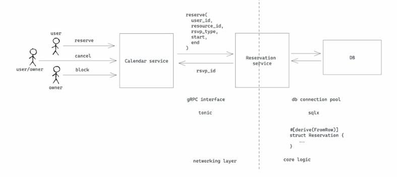
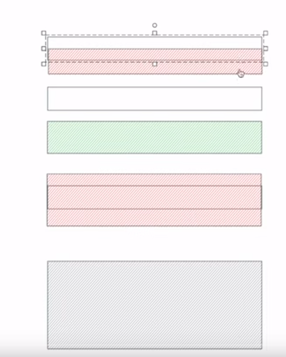
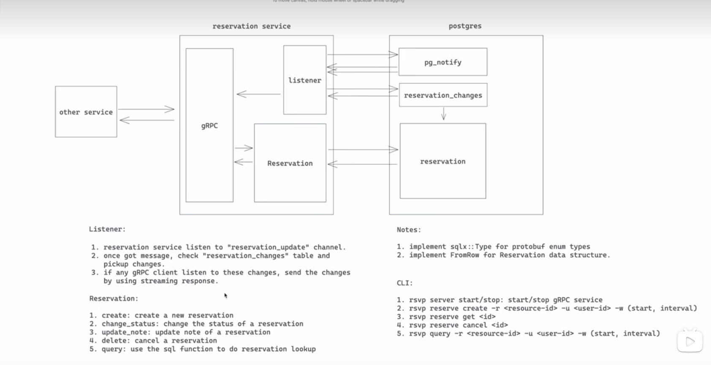

# Core Reservation Service

- Feature Name: core-reservation-service
- Start Date: 2022-12-3

## Summary

A core reservation service that solves  the problem of reserving a resource for a period of time. We leverage postgres EXCLUDE constraints to ensure that only one reservation can be made for a given resource at a given time.

## Motivation

We need a common solution for various reservation requirements: 1) calender booking; 2) hotel/room booking; 3) meeting room booking; 4) parking lot booking; 5) etc. Repeatedly building features for these requirements is a waste of time and resources. We should have a common solution that can be used by all teams.

## Guide-level explanation

Basic architecture: 



### Service interface

we would use gRPC as a service interface. Below is the proto definition:

```proto
enum ReservationStatus {
    UNKNOWN = 0;
    PENDING = 1;
    CONFIRMED = 2;
    BLOCKED = 3;
}

enum ReservationUpdateType {
    UNKNOWN = 0;
    CREATE = 1;
    UPDATE = 2;
    DELETE = 3;
}

message Reservation {
    string id = 1;
    string user_id = 2;
    ReservationStatus status = 3;

    // resource reservation window
    string resource_id = 4;
    google.protobuf.Timestamp start = 5;
    google.protobuf.Timestamp end = 6;

    // extra note
    string note = 7;
}

message ReserveRequest {
    Reservation reservation = 1;
}

message ReserveResponse {
    Reservation reservation = 1;
}

message UpdateRequest {
    string note = 2;
}

message UpdateResponse {
    Reservation reservation = 1;
}

message ConfirmRequest {
    string id = 1;
}

message ConfirmResponse {
    Reservation reservation = 1;
}

message CancelRequest {
    string id = 1;
}

message CancelResponse {
    Reservation reservation = 1;
}

message GetRequest {
    string id = 1;
}

message GetResponse {
    Reservation reservation = 1;
}

message QueryRequest {
    string resource_id = 1;
    string user_id = 2;
    // use status to filter result. If UNKNOWN, return all reservations
    ReservationStatus status = 3;
    google.protobuf.Timestamp start = 4;
    google.protobuf.Timestamp end = 5;
}

message ListenRequest {}
message ListenResponse {
    int8 op = 1;
    Reservation reservation = 2;
}

service ReservationService {
    rpc reserve(ReserveRequest) returns (ReserveResponse);
    rpc confirm(ConfirmRequest) returns (ConfirmResponse);
    rpc update(UpdateRequest) returns (UpdateResponse);
    rpc cancel(CancelRequest) returns (CancelResponse);
    rpc get(GetRequest) returns (GetResponse);
    rpc query(QueryRequest) returns (stream Reservation);
    // another system could monitor newly added/confirmed/cancelled reservations
    rpc listen(ListenRequest) returns (stream Reservation);
}
```

### Database schema

We use postgres as database. Below is the schema:

```sql
CREATE SCHEMA rsvp;
CREATE TYPE rsvp.reservations_status AS ENUM ('unknown', 'pending', 'confirm', 'blocked');
CREATE TYPE rsvp.reservations_update_type AS ENUM ('unknown', 'create', 'update', 'delete');

CREATE TABLE rsvp.reservations (
    id uuid NOT NULL DEFAULT uuid_generate_v4(),
    user_id VARCHAR(64) NOT NULL,
    status rsvp.reservation_status NOT NULL DEFAULT 'pending',

    resource_id VARCHAR(64) NOT NULL,
    timespan TSTZRANGE NOT NULL,

    note TEXT,
    create_at timestamp with time zone NOT NULL DEFAULT now(),
    update_at timestamp with time zone NOT NULL DEFAULT now(),

    CONSTRAINT reservations_key PRIMARY KEY (id),
    CONSTRAINT reservations_conflict EXCLUDE USING gist (resource_id WITH =, timespan WITH &&)
);
CREATE INDEX reservations_resource_id_idx ON rsvp.reservations (resource_id);
CREATE INDEX reservations_user_id_idx ON rsvp.reservations (user_id);

-- if user_id is null, find all reservations within during for the resource
-- if resource_id is null, find all reservations within during for the user
-- if both are null, find all reservation within during
-- if both set, find all reservation within during for the resource and user
CREATE OR REPLACE FUNCTION rsvp.query(uid text, rid text, during: TSTZRANGE) RETURNS TABLE rsvp.reservations AS $$ $$ LANGUAGE plpgsql;

-- reservation change queue
CREATE TABLE rsvp.reservation_changes (
    id SERIAL NOT NULL,
    reservation_id uuid NOT NULL,
    op rsvp.reservation_update_type NOT NULL,
)

-- trigger for add/update/delete a reservation
CREATE OR REPLACE FUNCTION rsvp.reservations_trigger() RETURNS TRIGGER AS 
$$
BEGIN
    IF TG_OP = 'INSERT' THEN
        -- update reservation_changes
        INSERT INTO rsvp.reservations_changes (reservation_id, op) VALUES (NEW.id, 'create');
    ELSIF TG_OP = 'UPDATE' THEN
        -- if status changed, update reservation_changes
        IF OLD.status <> NEW.status THEN
            INSERT INTO rsvp.reservations_changes (reservation_id, op) VALUES (NEW.id, 'update');
    ELSIF TG_OP = 'DELETE' THEN
        -- update reservation_changes
        INSERT INTO rsvp.reservations_changes (reservation_id, op) VALUES (OLD.id, 'delete');
    END IF;
    -- notify a channel called reservation_update
    NOTIFY reservation_update;
    RETURN NULL;
END;
$$ LANGUAGE plpgsql;

CREATE TRIGGER rsvp.reservations_trigger
    AFTER INSERT OR UPDATE OR DELETE ON rsvp.reservations
    FOR EACH ROW EXECUTE PROCEDURE rsvp.reservations_trigger();
```

Here we use EXCLUDE constraint provided by postgres to ensure that on overlapping reservations cannot be made for a given resource at a given time.
```sql
CONSTRAINT reservations_conflict EXCLUDE USING gist (resource_id WITH =, timespan WITH &&)
```



We also use a trigger to notify a channel when a reservation is added/updated/deleted. To make sure even we missed certain messages from the channel when DB connection is down for some reason, we use a queue to store reservation changes. Thus when we receive a notification, we can query the queue to get all the changes since last time we checked, and once we finished processing all the changes, we can delete them from the queue.

### Core flow



Explain the proposal as if it was already included in the language and you were teaching it to another Rust programmer. That generally means:

- Introducing new named concepts.
- Explaining the feature largely in terms of examples.
- Explaining how Rust programmers should *think* about the feature, and how it should impact the way they use Rust. It should explain the impact as concretely as possible.
- If applicable, provide sample error messages, deprecation warnings, or migration guidance.
- If applicable, describe the differences between teaching this to existing Rust programmers and new Rust programmers.
- Discuss how this impacts the ability to read, understand, and maintain Rust code. Code is read and modified far more often than written; will the proposed feature make code easier to maintain?

For implementation-oriented RFCs (e.g. for compiler internals), this section should focus on how compiler contributors should think about the change, and give examples of its concrete impact. For policy RFCs, this section should provide an example-driven introduction to the policy, and explain its impact in concrete terms.

## Reference-level explanation

TBD

## Drawbacks

N/A

## Rationale and alternatives

N/A

## Prior art

Discuss prior art, both the good and the bad, in relation to this proposal.
A few examples of what this can include are:

- For language, library, cargo, tools, and compiler proposals: Does this feature exist in other programming languages and what experience have their community had?
- For community proposals: Is this done by some other community and what were their experiences with it?
- For other teams: What lessons can we learn from what other communities have done here?
- Papers: Are there any published papers or great posts that discuss this? If you have some relevant papers to refer to, this can serve as a more detailed theoretical background.

This section is intended to encourage you as an author to think about the lessons from other languages, provide readers of your RFC with a fuller picture.
If there is no prior art, that is fine - your ideas are interesting to us whether they are brand new or if it is an adaptation from other languages.

Note that while precedent set by other languages is some motivation, it does not on its own motivate an RFC.
Please also take into consideration that rust sometimes intentionally diverges from common language features.

## Unresolved questions

- how to handle repeated reservation? - is this more ore less a business logic which shouldn't be put into this layer? (non-goal: we consider this is a business logic and should be handled by the caller)
- if load is big, we may use an external queue for recording changes.
- we haven't considered observability/deployment yet.
- query performance might be an issue - need to revisit the index and also consider using cache.

## Future possibilities

TBD